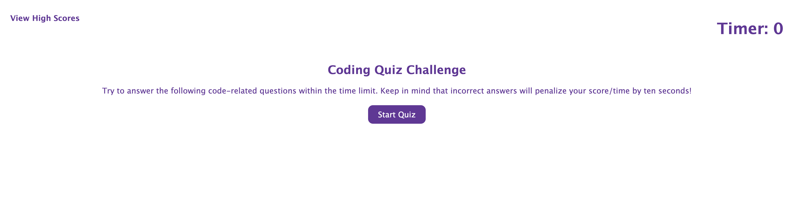
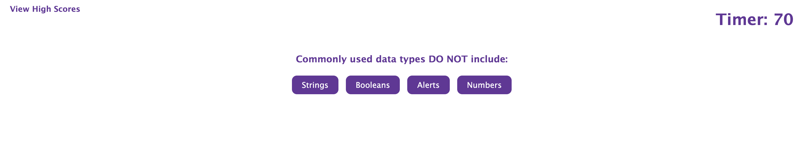

This application is a quiz that tests individuals coding knowledge. If the user gets the question correct, they are given another question to answer. If the user gets the question wrong, they are given another question to answer, but they are also deducted 10 seconds from their time. When they have finished answering all of the questions, their time remaining will equal their score. If they have the highest score, it will be presented in the High Scores view. This application was built mostly using JavaScript, as well as CSS and HTML.

The deployed application can be found [here](https://squidbeaks.github.io/code-quiz/).

Below are images to illustrate what the application looks like.

